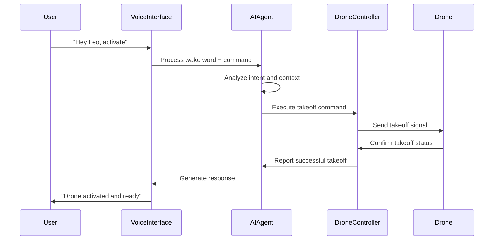
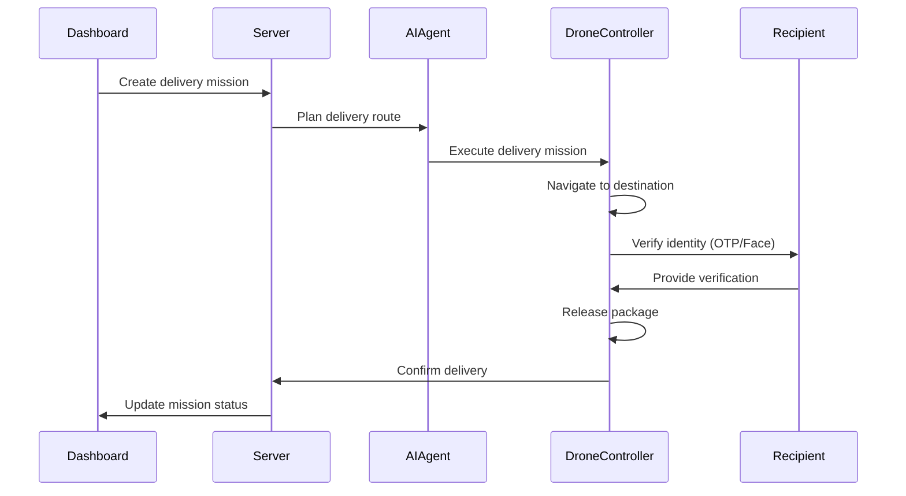
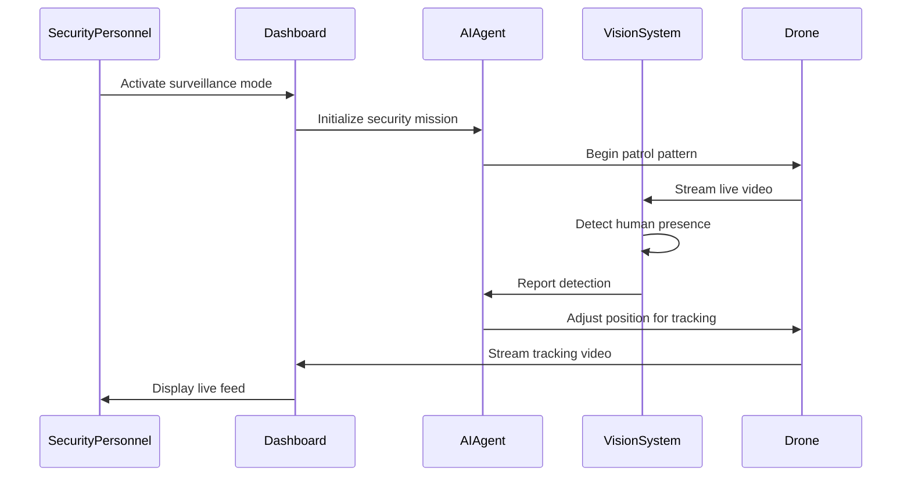

# Design

*Generated via Kiro, outlining your solution architecture and interaction flows.*

## System Architecture

### High-Level Architecture

```
┌─────────────────┐    ┌─────────────────┐    ┌─────────────────┐
│   Web Dashboard │    │  Voice Interface│    │   Mobile App    │
│    (React)      │    │   (Microphone)  │    │   (Optional)    │
└─────────┬───────┘    └─────────┬───────┘    └─────────┬───────┘
          │                      │                      │
          └──────────────────────┼──────────────────────┘
                                 │
                    ┌─────────────┴─────────────┐
                    │     Central Server        │
                    │   (FastAPI/WebSocket)     │
                    │                           │
                    │  ┌─────────────────────┐  │
                    │  │   Agentic AI Core   │  │
                    │  │    (Ollama LLM)     │  │
                    │  └─────────────────────┘  │
                    │                           │
                    │  ┌─────────────────────┐  │
                    │  │  Mission Planner    │  │
                    │  └─────────────────────┘  │
                    │                           │
                    │  ┌─────────────────────┐  │
                    │  │   State Manager     │  │
                    │  └─────────────────────┘  │
                    └─────────────┬─────────────┘
                                  │
                    ┌─────────────┴─────────────┐
                    │      Drone Controller     │
                    │     (Python/DJI SDK)     │
                    │                           │
                    │  ┌─────────────────────┐  │
                    │  │  Flight Control     │  │
                    │  └─────────────────────┘  │
                    │                           │
                    │  ┌─────────────────────┐  │
                    │  │  Computer Vision    │  │
                    │  │   (OpenCV/YOLO)     │  │
                    │  └─────────────────────┘  │
                    │                           │
                    │  ┌─────────────────────┐  │
                    │  │  Navigation System  │  │
                    │  └─────────────────────┘  │
                    └─────────────┬─────────────┘
                                  │
                         ┌────────┴────────┐
                         │   DJI Tello     │
                         │     Drone       │
                         └─────────────────┘
```

### Component Architecture

#### 1. Central Server Layer
- **API Gateway**: FastAPI-based REST and WebSocket endpoints
- **Agentic AI Core**: Ollama-powered decision making and task planning
- **Mission Planner**: Route optimization and task scheduling
- **State Manager**: Real-time system state and drone status tracking
- **Authentication Service**: User management and security

#### 2. Drone Controller Layer
- **Flight Control Module**: Direct drone command interface
- **Computer Vision Pipeline**: Real-time image processing and analysis
- **Navigation System**: Waypoint management and obstacle avoidance
- **Sensor Integration**: Battery, GPS, and environmental sensors

#### 3. Client Layer
- **Web Dashboard**: Real-time monitoring and control interface
- **Voice Interface**: Wake-word detection and command processing
- **Mobile App**: Optional companion application

## Data Flow Architecture

### 1. Voice Command Flow
```
Voice Input → Wake Word Detection → Speech-to-Text → 
Intent Recognition → AI Agent Processing → Command Execution → 
Drone Action → Status Feedback → Voice Response
```

### 2. Delivery Mission Flow
```
Delivery Request → Mission Planning → Route Calculation → 
Takeoff → Navigation → Recipient Verification → 
Package Drop → Confirmation → Return Home → Mission Log
```

### 3. Security Surveillance Flow
```
Security Command → Target Identification → Tracking Activation → 
Real-time Following → Threat Detection → Alert Generation → 
Continuous Monitoring → Mission Completion
```

## Interaction Flows

### Voice Command Interaction


### Delivery Mission Interaction


### Security Surveillance Interaction


## Technical Design Decisions

### 1. Communication Protocols
- **WebSocket**: Real-time bidirectional communication for live updates
- **REST API**: Standard CRUD operations and mission management
- **UDP**: Low-latency drone command transmission
- **MQTT**: Lightweight messaging for sensor data

### 2. AI Integration Strategy
- **Local Inference**: Ollama for privacy and low-latency responses
- **Edge Computing**: On-device processing for critical safety decisions
- **Hybrid Approach**: Cloud backup for complex reasoning tasks

### 3. Safety Architecture
- **Redundant Systems**: Multiple failsafe mechanisms
- **Geofencing**: Virtual boundaries for safe operation zones
- **Emergency Protocols**: Automatic return-to-home on system failures
- **Manual Override**: Always-available human control

### 4. Data Management
- **Real-time State**: In-memory storage for active missions
- **Mission Logs**: Persistent storage for audit and analysis
- **Video Streams**: Temporary buffering with optional recording
- **User Data**: Encrypted storage for authentication and preferences

## Scalability Considerations

### Multi-Drone Support
- **Fleet Management**: Centralized coordination of multiple drones
- **Load Balancing**: Intelligent task distribution
- **Collision Avoidance**: Inter-drone communication protocols
- **Resource Optimization**: Battery and payload management

### Performance Optimization
- **Caching Strategy**: Frequently accessed data and routes
- **Async Processing**: Non-blocking operations for responsiveness
- **Resource Pooling**: Efficient utilization of compute resources
- **Progressive Loading**: Optimized data transfer for web interface

## Security Design

### Authentication & Authorization
- **Multi-factor Authentication**: Secure access to control systems
- **Role-based Access**: Different permissions for different user types
- **API Key Management**: Secure service-to-service communication
- **Session Management**: Secure and time-limited user sessions

### Data Protection
- **End-to-end Encryption**: Secure communication channels
- **Data Anonymization**: Privacy protection for surveillance data
- **Audit Logging**: Comprehensive activity tracking
- **Secure Storage**: Encrypted data at rest

### Operational Security
- **Geofencing**: Restricted operation zones
- **Emergency Shutdown**: Remote disable capabilities
- **Tamper Detection**: Physical security monitoring
- **Network Security**: Isolated drone communication network